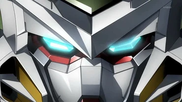
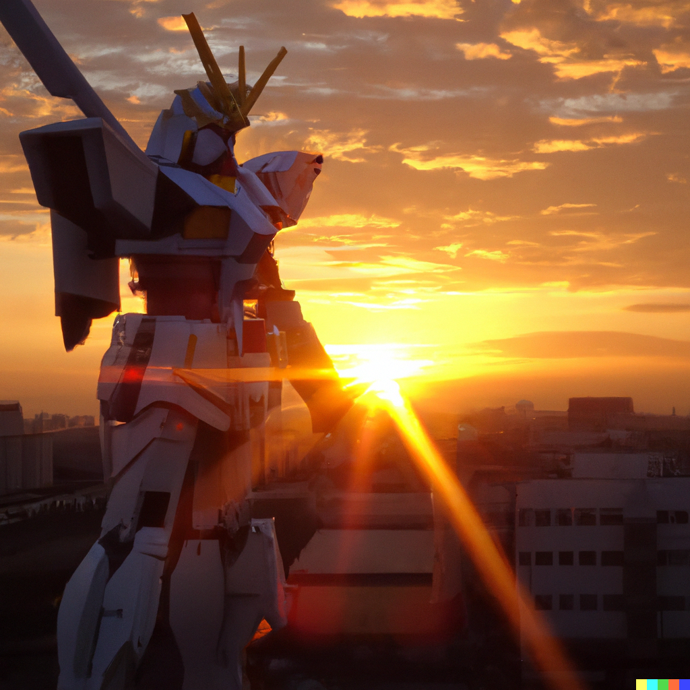

 ## Its A Gundam

  

Gundam Wing is a popula Japanese anime series that follows five teenage boys as they pilot massive robots called “Gundams” in a war to liberate Earth from the oppressive forces of the United Earth Sphere Alliance. The story takes place in the year After Colony 195, in a time of conflict between the Alliance and the space colonies ruled by the United Earth Sphere Alliance. The main characters in the series are the five Gundam pilots: Heero Yuy, Duo Maxwell, Trowa Barton, Quatre Raberba Winner, and Chang Wufei.
The Gundam Wing series is set in a future where Earth and its colonies are locked in a struggle for independence. The five young Gundam pilots are sent to Earth by their respective colonies to use the Gundams to fight for the colonies’ freedom. The pilots must battle against the Alliance forces, as well as their own personal demons, in order to achieve victory. The anima series follows their struggles as they fight against the oppressive forces of the Alliance.

<a href="https://github.com/Gafalcons7/Gafalcons7.github.io/blob/main/about.md">This is my About ME page</a>

